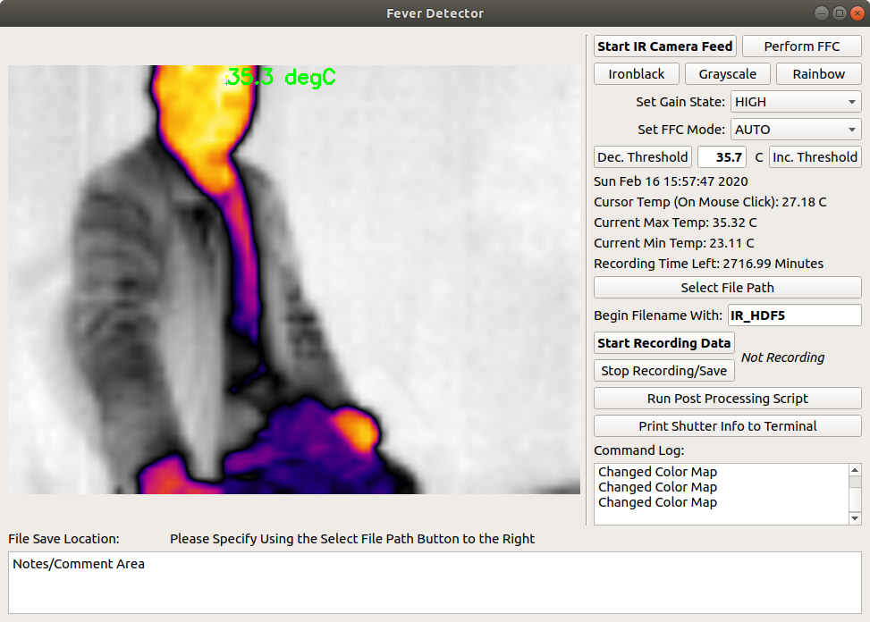

# FeverDetector

Detect people who have fevers with FLIR Lepton + PureThermal Smart I/O Module

## Hardware requirements

- PC or Raspberry Pi which can run Linux
- FLIR Lepton 2.5 or 3.5
- PureThermal 1/2/Mini
- A USB cord with appropriate length

## Linux Platforms

- PC/NB running with Debian/Ubuntu distributions.
- Raspbian (tested) on Raspberry Pi 3 model B+ or above.

__NOTE__ Linux (< 4.0) + V4L (and OpenCV)

Linux Kernel versions less than 4.0 don't match the UVC format UVC_GUID_FORMAT_BGR3 with V4L2_PIX_FMT_BGR24. Applications that use libv4l and depend on the BGR24 format (such as the VideoCapture module of OpenCV) will not be able to use this format. Instead, they will use software scaling to convert RGB565 into RGB24/BRG24, at a loss in color resolution and with expense to CPU.

## Quick Start

1. Clone this respository by `git clone https://github.com/MakeHub-tw/FeverDetector.git`
2. Execute `setup_linux_env.sh` to set up libraries and dependencies.
3. Go to `src` folder, and launch the application by `python3 FeverDetector.py`

You're ready to go.
## Useful Links:

- This application is modified from <https://github.com/Kheirlb/purethermal1-uvc-capture>
- A more complete and complex application implemented in CPP and Qt: <https://github.com/groupgets/GetThermal>

## Additional Comments:

Special thanks to Parabilis Space Technologies, Jerry Pierre, the developers of GroupGets GetThermal and purethermal1-uvc-capture, and the Flir Community Forum who helped me achieve my goals in this project.
